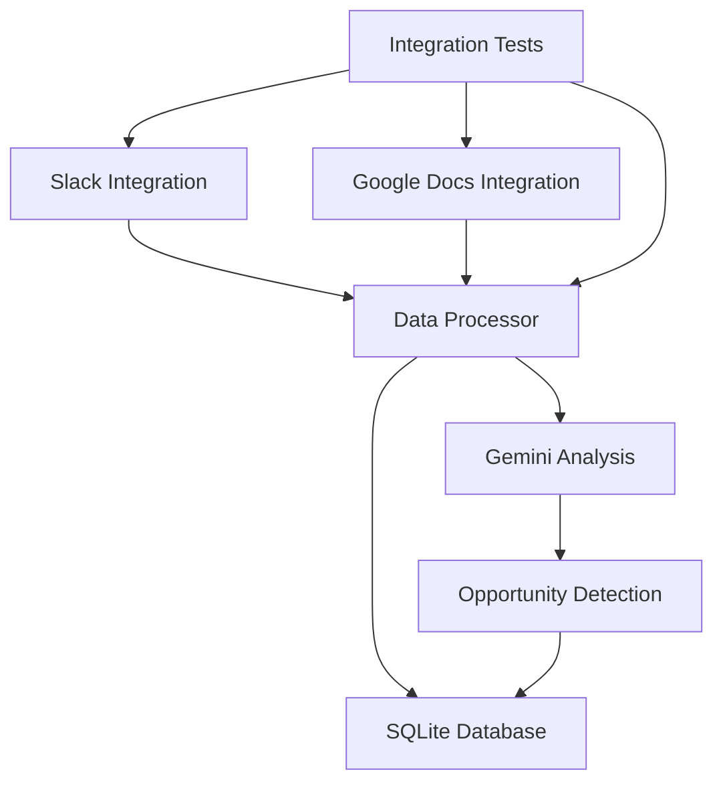

# System Architecture Overview

This diagram shows the high-level system components and their interactions:
1. Data Sources (Slack and Google Docs)
2. Data Processing Layer
3. Storage Layer (SQLite)
4. Analysis Layer (Gemini)
5. Test Coverage 