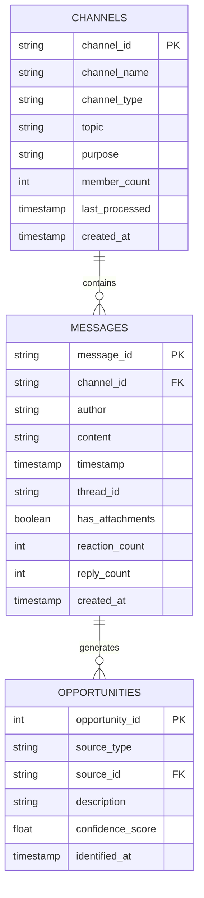

# Database Schema

This diagram shows the database schema relationships:
1. Channels to Messages (one-to-many)
2. Messages to Opportunities (one-to-many)
3. Key fields and their types
4. Foreign key relationships 