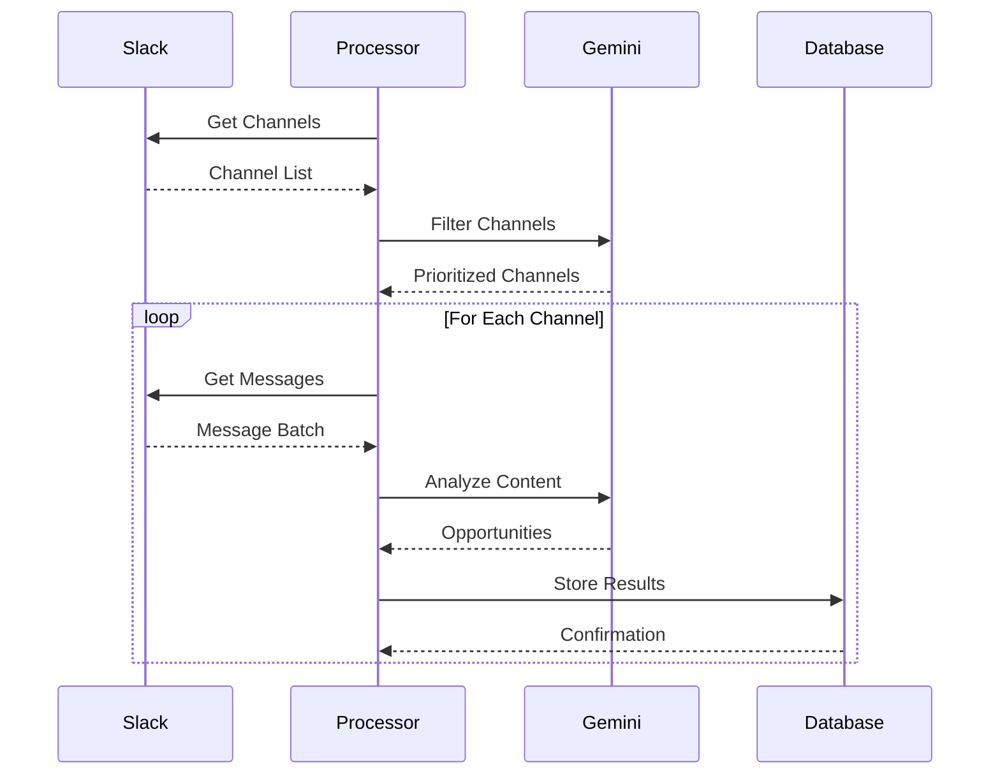

# Data Collection Flow

This diagram illustrates the data collection and processing flow:
1. Initial channel collection
2. Channel prioritization
3. Message batch processing
4. Content analysis
5. Data storage 